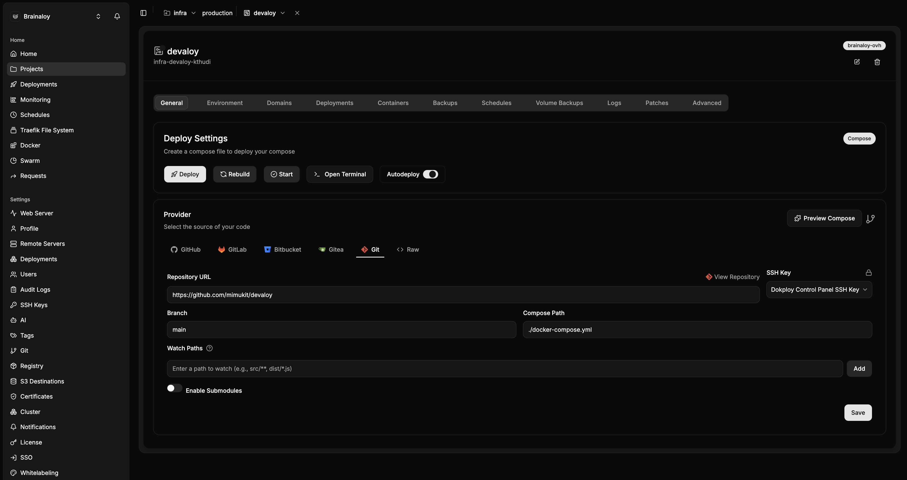

# Deploying devaloy with Dokploy

This walks through running the devbox as a [Dokploy](https://dokploy.com/)
**Compose** service, deployed straight from this GitHub repo. It assumes you
already have a Dokploy server running.

Dokploy changes very little about how this stack works. It clones the repo,
writes an `.env` next to the compose file, and runs
`docker compose -p <service-name> up -d --build` for you. Everything the
[README](../../README.md) says about Tailscale, the home volume and the
toolchain still holds — what Dokploy adds is a UI for the env vars, a deploy
button, a push webhook, and volume backups.

What Dokploy does *not* add: a domain, a Traefik route, or a published port.
This devbox has no HTTP surface and nothing to expose. You will leave the
**Domains** tab empty, and that is correct rather than an unfinished step.

## 1. Prepare the Dokploy host

Pick which server the service runs on first (Dokploy can manage remote
servers) — every prerequisite below applies to *that* host, not the panel.

### The `tun` module

The container needs `/dev/net/tun` on the host. Check and load it:

```sh
ls -l /dev/net/tun || sudo modprobe tun
```

Make it survive a reboot, or the next time the VPS restarts the devbox will
come back up with no tailnet and no way in:

```sh
echo tun | sudo tee /etc/modules-load.d/tun.conf
```

`SYS_MODULE` is deliberately not granted to the container, so it cannot load
the module itself — see the README for why.

### Tailnet policy file and auth key

Do these in the Tailscale admin console before deploying; they are unchanged by
Dokploy, so follow [README → One-time setup](../../README.md#one-time-setup)
steps 2 and 3. You need:

- an `ssh` rule in the policy file granting `autogroup:member` → `autogroup:self`
  as user `dev`
- a **reusable, non-expiring, untagged** auth key

Have the auth key on your clipboard for step 3.

## 2. Create the Compose service

In Dokploy: **Projects** → open (or create) a project and environment →
**Create Service** → **Compose**. Then, on the service's **General** tab, fill
in the **Provider** panel:



| Field | Value | Why |
|---|---|---|
| Provider tab | **Git** | The generic Git source works for any remote and needs no GitHub App install. Pick **GitHub** instead if you want PR/branch integration; **Raw** only if you paste the compose file in and drop `build:` for a prebuilt image. |
| Repository URL | `https://github.com/mimukit/devaloy` | HTTPS is fine for a public repo. |
| SSH Key | *Dokploy Control Panel SSH Key* | Unused for a public HTTPS clone. For a **private** repo, switch the URL to `git@github.com:mimukit/devaloy.git` and add this key's public half as a deploy key on the repo. |
| Branch | `main` | |
| Compose Path | `./docker-compose.yml` | The default. This repo deliberately uses that filename — a custom one gets dropped by the **Start** button ([#2282](https://github.com/Dokploy/dokploy/issues/2282)). |
| Watch Paths | *(see §5)* | Leave empty for now. |
| Enable Submodules | off | Nothing here uses them. |

Hit **Save**.

Note the server chip in the top-right (`brainaloy-ovh` in the screenshot) — that
is the host the container actually lands on, and the one §1's `tun` prerequisite
applies to.

If your Dokploy version exposes a **Compose Type** selector, keep it on
**Docker Compose** rather than **Stack**. Swarm ignores `devices:` and
`cap_add:`, so `tailscaled` would come up with no `tun` and no `NET_ADMIN`, and
`build:` is unsupported there too.

## 3. Environment variables

Open the service's **Environment** tab and paste:

```sh
TS_AUTHKEY=tskey-auth-...
GITHUB_TOKEN=ghp_...
```

Dokploy writes these to an `.env` file beside the checked-out compose file, and
`docker-compose.yml` already reads them via `${TS_AUTHKEY}` / `${GITHUB_TOKEN}`
interpolation — so there is nothing to add to the compose file itself, and no
`env_file:` needed.

`GITHUB_TOKEN` is optional; see
[README → GitHub token](../../README.md#4-optional-github-token) for what it
buys you and what it costs (a live credential lands in the home volume).
`TS_HOSTNAME`, `TS_ACCEPT_DNS`, `MISE_NODE_VERSION` and `MISE_HERDR_VERSION`
are optional overrides and can go here too.

Treat this tab as the secret store: the auth key is non-expiring and never
belongs in git. `.env` is gitignored in this repo for the same reason.

## 4. Deploy

Hit **Deploy** in the button row at the top of the **General** tab. The first
build pulls `ubuntu:24.04` and installs the apt layer, so give it a few minutes.
Watch the **Logs** tab for `[entrypoint]` lines.

The neighbouring buttons: **Rebuild** re-runs the build and recreates the
container, **Start** brings a stopped stack back up, and **Open Terminal** drops
you onto the host — useful for the break-glass path in §6, and the one way in
that does not depend on the tailnet being healthy.

The tailnet comes up *before* the toolchain install, so the node appears in the
[admin console](https://login.tailscale.com/admin/machines) well before the box
is fully provisioned. A cold home volume then spends several more minutes in
`mise` pulling node, Claude Code and Codex — you can log in and watch it rather
than waiting.

Once the node shows up: **disable key expiry on it.** A user-owned node key
expires in roughly 180 days, and an expired node is unreachable — recovering it
means getting back to the Docker host.

Then, from any device on your tailnet:

```sh
ssh dev@devbox
herdr
```

## 5. Autodeploy and Watch Paths

The **Autodeploy** toggle sits in that same button row and redeploys on every
push to `main`. That is convenient and it has a real cost: a redeploy recreates
the container, killing every running process — including the `herdr` server
holding your session. Files in `/home/dev` survive; the session you were mid-way
through does not.

With **Watch Paths** empty, a one-word README fix redeploys the box and drops
whatever you had attached. So pick one:

- **Autodeploy off** — deploy by hand, when you know nothing is attached. The
  safest option for a box you SSH into from a phone.
- **Autodeploy on, with Watch Paths set** — restrict it to the paths that
  actually change the container, so doc and plan commits are ignored:

  ```
  Dockerfile
  docker-compose.yml
  entrypoint.sh
  bootstrap-toolchain.sh
  devaloy-update
  link-shims
  config/**
  ```

  Add them one at a time with the **Add** button.

The screenshot above has Autodeploy on and Watch Paths empty — worth changing
one or the other before you start relying on the box.

## 6. Day-2 operations

**Updating the toolchain.** Unchanged by Dokploy — the toolchain installs once
per home volume, so a redeploy never swaps tools out from under a live session.
To pick up newer versions, SSH in and run `devaloy-update`. Adding a tool to
`bootstrap-toolchain.sh` also requires bumping `TOOLSET_REVISION` in that file,
or a provisioned box will keep skipping the bootstrap.

**Changing shell or agent config.** Edit under `config/` in this repo, push, and
hit **Deploy** (or **Rebuild** if the `Dockerfile` changed). The entrypoint
copies `config/` over `/home/dev` on every boot, so the repo wins — that is the
whole point of config-as-code here.

**Break-glass.** If the box drops off the tailnet, use **Open Terminal** on the
General tab (or SSH to the host) and run:

```sh
docker exec -it devaloy-devbox tailscale status
docker exec -it devaloy-devbox tailscale up --ssh
```

There is no sshd fallback by design.

## 7. Volumes and backups

Dokploy runs `docker compose -p <appName>`, where `appName` is the generated
slug shown in grey under the service title — `infra-devaloy-kthudi` in the
screenshot, i.e. `<project>-<service>-<random>`, **not** the service name you
typed. That slug is the volume prefix:

| Volume | Holds | Losing it means |
|---|---|---|
| `<appName>_devbox-home` | `/home/dev` — repos, toolchain, agent credentials, GitHub token | Re-clone and re-provision |
| `<appName>_tailscale-state` | The node's identity | The box rejoins as a *new* machine and needs a fresh auth key |

Confirm the real names before you write any script against them:

```sh
docker volume ls | grep devbox-home
```

Both are Docker named volumes, so the **Volume Backups** tab works on them. It
is worth enabling on the `tailscale-state` one — it is tiny, and it is the
difference between a redeploy and a re-enrollment.

**Deleting the service in Dokploy can delete these volumes.** Read the
confirmation dialog. The README's backup contract still applies regardless:
git-push discipline is the only real backup, and nothing valuable should live
only on the devbox.

## 8. Do not run the host firewall script

`scripts/host-firewall-lockdown.sh` sets `ufw default deny incoming` and allows
traffic only on `tailscale0`. On a plain VPS that is sensible defense-in-depth.
**On a Dokploy host it will cut off Dokploy itself** — the panel on port 3000
and Traefik on 80/443 all become unreachable from the public internet, taking
every other site on that server with them.

Only run it if the Dokploy host exists solely for this devbox *and* you want to
reach the panel over the tailnet only. Otherwise skip it: the devbox publishes
no ports and needs no host firewall rule to stay private.

## Troubleshooting

| Symptom | Cause | Fix |
|---|---|---|
| `no such file or directory: docker-compose.yml` | Compose Path wrong, or pointed at a filename this repo doesn't have | Set Compose Path to `./docker-compose.yml` |
| Node never appears in the admin console | `TS_AUTHKEY` empty or expired | Check the Environment tab actually saved; the compose file defaults it to empty and `tailscaled` starts unauthenticated |
| `Warning: TS_AUTHKEY variable is not set` in build logs | Dokploy's `.env` landed beside the wrong file ([#2777](https://github.com/Dokploy/dokploy/issues/2777)) | Confirm the Environment tab is saved and redeploy; verify with `docker exec devaloy-devbox printenv TS_AUTHKEY` |
| `failed to create TUN device` | Host missing `tun` | `sudo modprobe tun`, then persist via `/etc/modules-load.d/tun.conf` |
| Tailnet up, but SSH is refused | Policy file has no matching `ssh` rule, or the auth key was tagged | Untagged key + the `autogroup:self` rule (README step 2) |
| Node reachable, `dev` login rejected | `users` list in the policy rule omits `dev` | Add `"users": ["dev"]` |
| `gh auth login` refuses to run | `GITHUB_TOKEN` is set — expected, not a fault | Clear it in the Environment tab and redeploy to use the interactive flow |
| Session vanished after a deploy | The deploy recreated the container | Expected. Turn Autodeploy off or set Watch Paths (§5) |

## Sources

- [Dokploy — Docker Compose](https://docs.dokploy.com/docs/core/docker-compose)
- [Dokploy — Environment Variables](https://docs.dokploy.com/docs/core/variables)
- [Dokploy — Volume Backups](https://docs.dokploy.com/docs/core/volume-backups)
- [Dokploy issue #2282 — custom Compose Path ignored on Stop/Start](https://github.com/Dokploy/dokploy/issues/2282)
- [Dokploy issue #2777 — env vars not loaded in Compose](https://github.com/Dokploy/dokploy/issues/2777)
